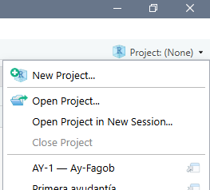
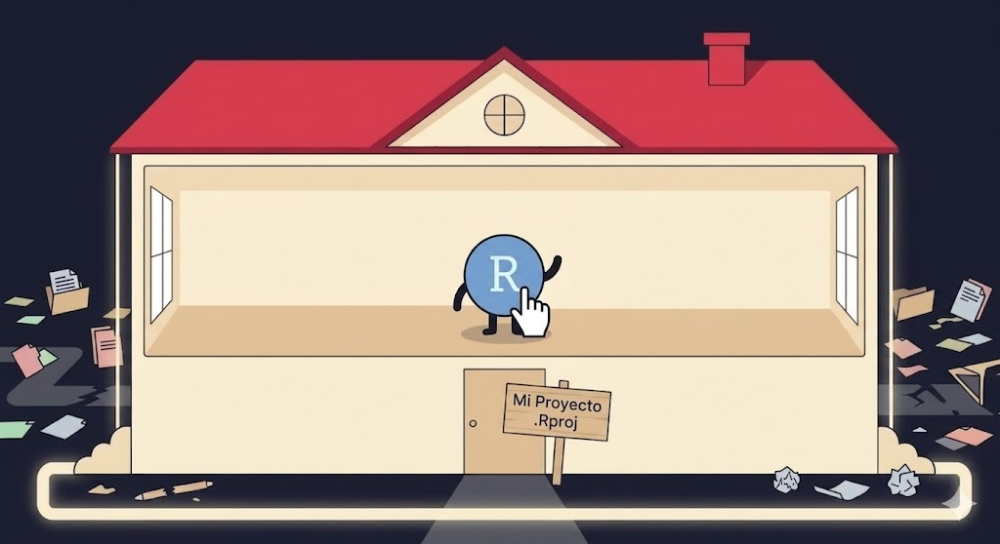
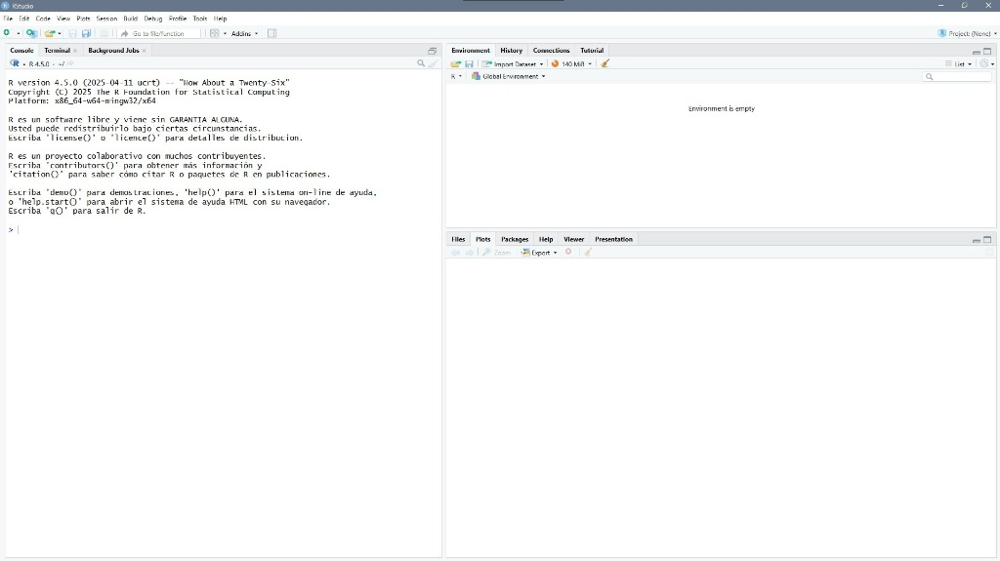
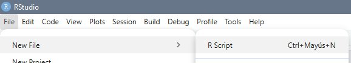
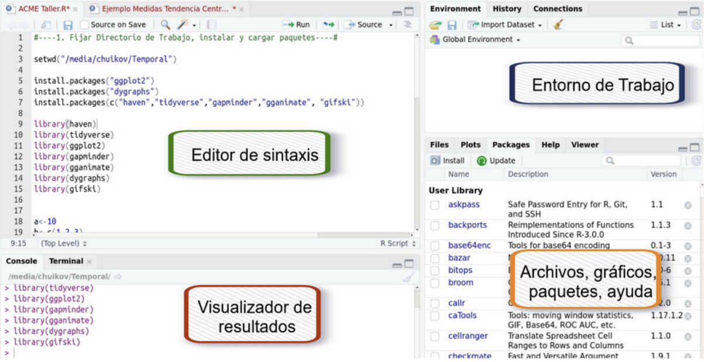
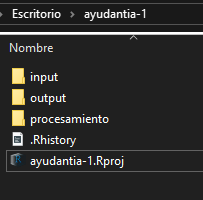
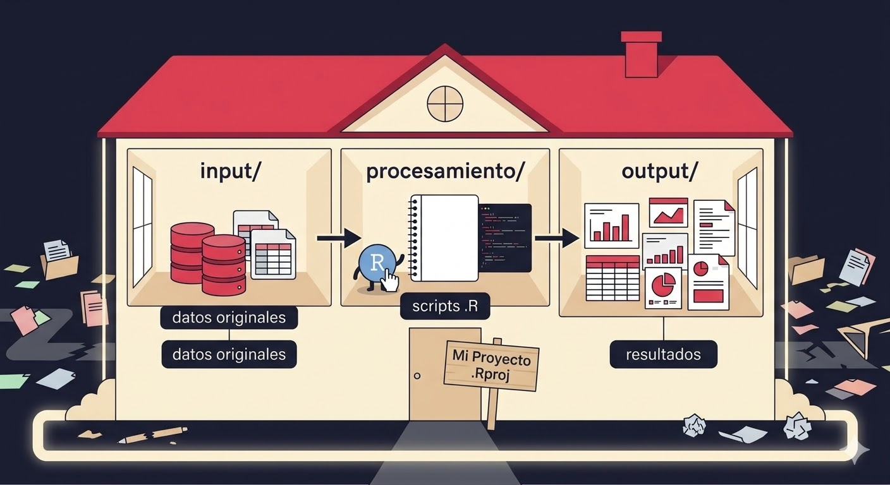

```{r setup, include=FALSE}
knitr::opts_chunk$set(
  echo    = TRUE,
  eval    = FALSE,
  comment = "#>",
  message = FALSE,
  warning = FALSE
)
```

background-color: #1a1a2e
class: middle

.badge[Ayudantía 01 · FAGOB 2026]

# Introducción a R y RStudio

.divider[]

**Métodos Cuantitativos para la Administración Pública**

.muted[
Cristóbal Mejías &nbsp;·&nbsp; Facultad de Gobierno  
Viernes 20 de marzo, 2026
]

---

## Agenda de hoy

.col-izq[
**¿Qué haremos?**

1. Diagnóstico inicial
2. El ecosistema de software
3. ¿Qué es R y por qué usarlo?
4. Conociendo RStudio
5. Sistema de carpetas
6. Cargar y explorar CASEN 2024
]

.col-der[
.caja-info[
**Duración:** 90 minutos

**Lo más importante:**
Al final de la sesión vas a poder abrir una base de datos real y explorarla en R.
]
]

---

background-color: #e94560
class: center, middle, white

# 01
# Diagnóstico inicial

---

## ¿Dónde estamos parados?

--

**¿Ya tienen R y RStudio instalados?**

--

**¿Han usado antes algún software estadístico?**
.muted[(SPSS, Stata, Excel para análisis...)]

--

**¿Tienen computador para traer a las próximas ayudantías?**

--

.caja[
Estos datos nos ayudan a calibrar el ritmo de las ayudantías y decidir si necesitamos sesiones de refuerzo.
]

---

background-color: #e94560
class: center, middle, white

# 02
# El ecosistema de software

---

## ¿Qué herramienta uso para qué?

| Herramienta | ¿Qué es? | ¿Para qué se usa? |
|---|---|---|
| **R** | Lenguaje estadístico | Análisis de datos, modelos, visualizaciones |
| **RStudio / Positron** | Entorno de trabajo (IDE) | Interfaz para escribir código en R |
| **Python** | Lenguaje de programación general | Machine learning, automatización, web |
| **VS Code** | Editor de código universal | Programar en cualquier lenguaje |


--

.caja[
**En este curso usamos R + RStudio** porque es el estándar en ciencias sociales cuantitativas, es gratuito y produce análisis reproducibles.
]

---

background-color: #e94560
class: center, middle, white

# 03
# ¿Qué es R y por qué usarlo?

---

## ¿Qué es R?

.col-izq[
R es un **lenguaje de programación estadístico** de código abierto, creado en 1993 por Ross Ihaka y Robert Gentleman en la Universidad de Auckland.

- +20.000 paquetes en CRAN
- Comunidad científica global
- Completamente gratuito
- Análisis **reproducibles**
]

.col-der[
.caja[
**¿Qué significa reproducible?**

Que otra persona puede tomar tu código y llegar exactamente al mismo resultado. Es el estándar de la **ciencia abierta**.
]

.caja-info[
R es usado por el INE, el Banco Mundial, el MDSF y miles de instituciones públicas para analizar datos.
]
]

---

## R vs. otros softwares

| | R | SPSS | Excel |
|---|:---:|:---:|:---:|
| Gratuito | ✅ | ❌ | ❌ |
| Reproducible | ✅ | ⚠️ | ❌ |
| Código abierto | ✅ | ❌ | ❌ |
| Gráficos avanzados | ✅ | ⚠️ | ⚠️ |

--

.caja[
En administración pública, la **transparencia y reproducibilidad** de los análisis es cada vez más exigida. R lo permite de forma nativa.
]

---

background-color: #e94560
class: center, middle, white

# 04
# Trabajar ordenadamente

---

## Proyectos de R (.Rproject)

Es necesario tener un ambiente ordenadamente. Para esto, vamos a trabajar dentro de *proyectos* (.Rproject), el cual será nuestro "hogar"... 

El primer paso será construir este *hogar* (proyecto)

<div style="text-align: center;">
  
</div>

---

## Proyectos de R (.Rproject)

<div style="text-align: center;">
  
</div>

1. New project -> New Directory -> New Project
2. Directory Name: Nombre sustantivo "ayudantia-1"
3. Browse: ubicación, por ej. "Métodos cuantitativos"
4. Seleccionan Open y Create Project
5. ¡Tienen su primer proyecto en R!

---

## Proyectos de R (.Rproject)

<div style="text-align: center;">
  
</div>

---

## Explorando R por primera vez

<div style="text-align: center;">
  
</div>


**Verán 3 paneles solamente**

---
## Explorando R por primera vez

<div style="text-align: center;">
  
</div>


**Deben ir a File -> New File -> R Script / o simplemente presionar Ctrl + Mayús + N**


---
## Los 4 paneles de RStudio

<div style="text-align: center;">
  
</div>

| Panel | Ubicación | ¿Para qué sirve? |
|---|---|---|
| **Editor / Script** | Arriba izquierda | Escribir y guardar tu código |
| **Consola / Visualizador ** | Abajo izquierda | Ejecutar código y ver resultados |
| **Entorno** | Arriba derecha | Ver objetos y datos cargados |
| **Archivos / Gráficos** | Abajo derecha | Explorar carpetas y visualizar gráficos |


---

background-color: #e94560
class: center, middle, white

# 05
# Sistema de carpetas

---

## Cómo organizar tu trabajo

Nuestra intención es crear trabajo *reproducible*
Se recomienda el sistema de carpetas IPO: Input, Procesamiento, Output

**ayudantia-1**
  - .Rproject
  - input
  - procesamiento
  - output

--

.col-izq[
**¿Por qué esto importa?**

- Siempre sabes dónde está cada cosa
- Evita rutas de archivo rotas
- Facilita el trabajo colaborativo
- Es el estándar en proyectos de datos
]

.col-der[
<div style="text-align: center;">
  
</div>
]

---

## Cómo organizar tu trabajo

<div style="text-align: center;">
  
</div>

---

## Primer contacto con R

Escribe esto en tu **Script** y ejecútalo con `Ctrl + Enter`. El cursor puede estar en **cualquier lugar de la LINEA**

```{r primer-codigo}
# Mi primer código en R
print("¡Hola desde Vicuña 20!")

# R como calculadora
2 + 2
sqrt(144)
log(100)

# Crear un objeto
caja <- "gatos" 
caja

a <- 4
a
a * 5
```

El símbolo `<-` es el operador de asignación en R. Atajo: `Alt + -`

---

background-color: #e94560
class: center, middle, white

# 06
# Cargar y explorar CASEN 2024

---

## Cargar la base de datos

Guarda el archivo `casen_ay1.csv` en tu carpeta `input` y luego:

```{r cargar}

# Instalar paquete (SOLO UNA VEZ)
install.packages("readr")

# Cargar paquete (SIEMPRE)
library(readr)

# Cargar la base

casen <- read.csv("input/casen_ay1.csv") 
#OJO: esta es la ruta al trabajar con sistema IPO (DENTRO de input)
```

*Instalar un paquete es traerlo a tu computador, cargar es usarlo*
---

## Explorar la base

```{r explorar}
# ¿Cuántas filas y columnas tiene?
dim(casen)
# Observamos que tiene 1000 filas (casos) y 10 columnas (variables)

# ¿Qué variables tiene?
names(casen)

# Resumen estadístico
summary(casen)
```

---

## Primeras preguntas a los datos

```{r preguntas}
# ¿Cuántas personas por región?
table(casen$region)

# Distribución por sexo
table(casen$sexo)

# Condición de pobreza
table(casen$pobreza)

# Promedio de edad
mean(casen$edad, na.rm = TRUE)

# Tabla cruzada: pobreza según sexo
table(casen$sexo, casen$pobreza)
```

 `na.rm = TRUE` le dice a R que ignore los valores perdidos (NA) al calcular el promedio

---


.badge[Ayudantía 01 · FAGOB 2026]

# ¡Nos vemos en la siguiente sesión!

Acuerdos... 